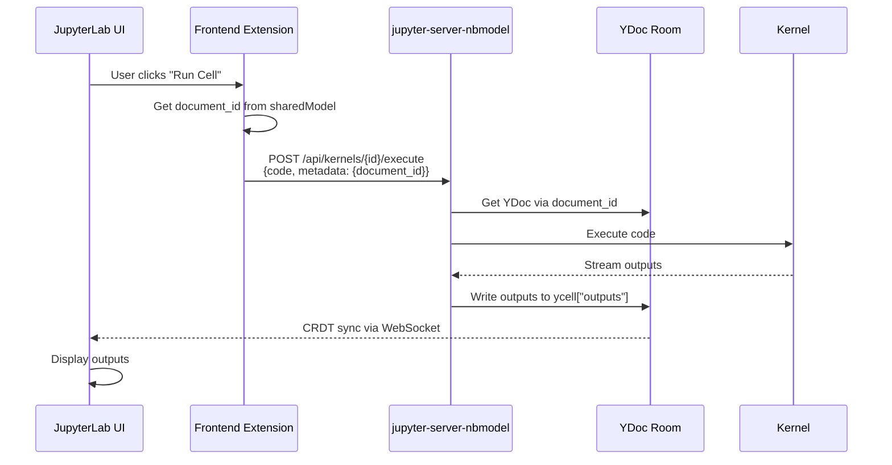
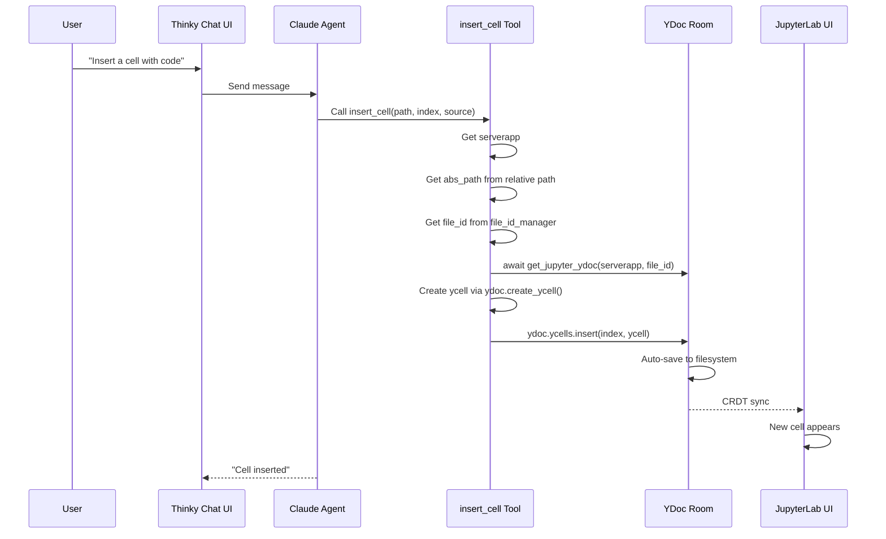
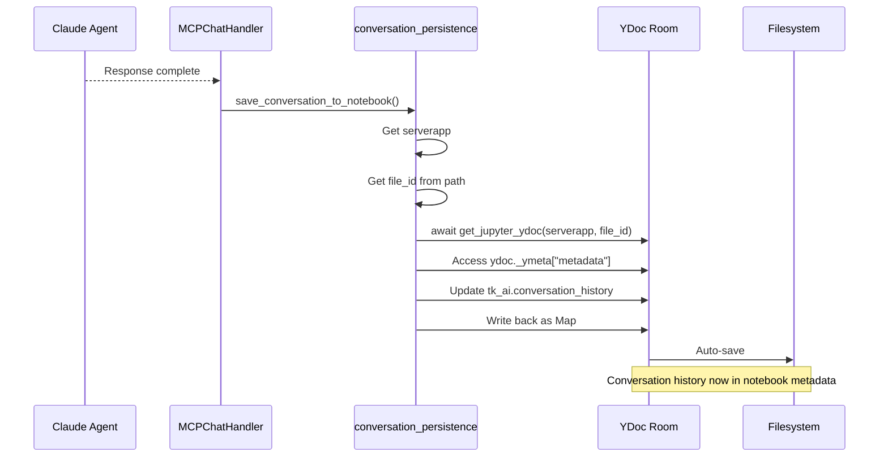
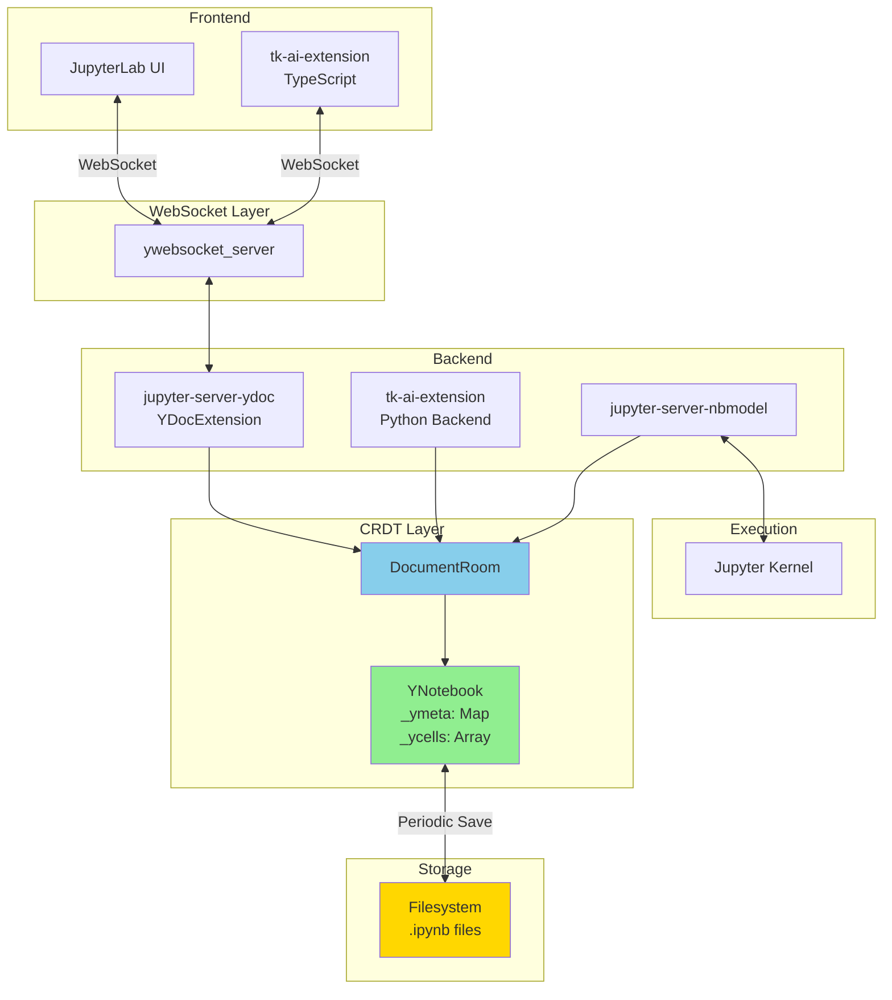

# JupyterLab Real-Time Collaboration Architecture in Thinkube

## Overview

Thinkube uses JupyterLab's Real-Time Collaboration (RTC) architecture to enable seamless synchronization between the user interface and backend AI agents (Thinky). This document explains the technical architecture, data flow, and critical implementation details.

### What is Real-Time Collaboration?

RTC in JupyterLab uses **Conflict-free Replicated Data Types (CRDTs)** to synchronize notebook state across multiple clients without conflicts. Changes made by any client (browser UI, backend tool, or kernel) are automatically propagated to all other connected clients.

### Why Thinkube Uses RTC

1. **AI Agent Integration**: Thinky (Claude) can modify notebooks and have changes appear instantly in the UI
2. **No Page Refreshes**: Cell insertions, executions, and edits sync automatically
3. **Consistent State**: Single source of truth via YDoc shared document
4. **Clean Architecture**: No file read/write operations needed for modifications

---

## Core Components

### 1. jupyter-server-ydoc

**Purpose**: Server-side CRDT document manager

- Manages "rooms" for each open notebook
- Synchronizes changes between all connected clients via WebSocket
- Persists YDoc state to filesystem
- Exposes YDoc API to backend code

**Key Classes**:
- `YDocExtension`: Main extension providing ywebsocket_server
- `DocumentRoom`: Manages a single notebook's collaboration session
- `YWebSocketServer`: WebSocket server for client connections

### 2. pycrdt

**Purpose**: Python CRDT library providing data structures

**Core Types**:
- `Doc`: Top-level CRDT document
- `Map`: Dictionary-like CRDT (for cell metadata, notebook metadata)
- `Array`: List-like CRDT (for cell array)
- `Text`: String CRDT with character-level operations (for cell source)

**Critical**: These types enable conflict-free merging. Plain Python types (dict, list, str) do NOT work with CRDT synchronization.

### 3. jupyter_ydoc.YNotebook

**Purpose**: Notebook representation as CRDT

**Structure**:
```python
class YNotebook:
    _ydoc: Doc               # Underlying CRDT document
    _ymeta: Map              # Notebook metadata (nbformat, nbformat_minor, metadata)
    _ycells: Array           # Array of cell Maps
```

**Cell Structure** (each element in `_ycells`):
```python
{
    "id": str,                    # Cell UUID
    "cell_type": str,             # "code" or "markdown"
    "source": Text,               # MUST be Text object, not plain string
    "metadata": Map,              # Cell metadata
    "execution_count": int|None,  # For code cells
    "outputs": Array,             # For code cells
}
```

**Key Method**:
- `create_ycell(cell_dict)`: Converts plain Python dict to proper CRDT cell
  - Converts `source` string → `Text` object
  - Converts `metadata` dict → `Map`
  - Converts `outputs` list → `Array` of `Map`s

### 4. jupyter-server-nbmodel

**Purpose**: Cell execution engine using RTC architecture

- Receives execute requests with `document_id`
- Looks up YDoc via document_id
- Executes code in kernel
- Writes outputs directly to YDoc cell
- YDoc automatically syncs to all clients

**API Endpoint**: `POST /api/kernels/{kernel_id}/execute`

**Request Body**:
```json
{
    "code": "print('hello')",
    "metadata": {
        "cell_id": "abc-123",
        "document_id": "json:notebook:uuid-here",
        "record_timing": true
    }
}
```

### 5. tk-ai-extension

**Purpose**: AI agent (Thinky) integration with JupyterLab

**Components**:
- **Frontend** (TypeScript): Sets document_id, provides chat UI
- **Backend** (Python): MCP tools for notebook manipulation
- **Tools**: insert_cell, update_cell, execute_cell, etc.

**How Tools Access YDoc**:
```python
# Get serverapp (has extension_manager)
serverapp = getattr(contents_manager, 'parent', None)

# Get absolute path
abs_path = get_notebook_path(serverapp, relative_path)

# Get file_id (UUID)
file_id_manager = serverapp.web_app.settings["file_id_manager"]
file_id = file_id_manager.get_id(abs_path)

# Get YDoc from active room
ydoc = await get_jupyter_ydoc(serverapp, file_id)

# Now can modify ydoc._ycells, ydoc._ymeta, etc.
```

### 6. file_id_manager

**Purpose**: Maps file paths to stable UUIDs

- Each file has a persistent UUID regardless of renames
- Multiple files can have same name in different directories
- UUIDs used for YDoc room identification

**Format**: Room ID = `json:notebook:{file_id}`

**API**: `GET /api/tk-ai/fileid?path=notebooks/example.ipynb`

**Response**:
```json
{
    "file_id": "be67854d-cce7-4e1a-b38d-c7588aff26cd",
    "path": "notebooks/example.ipynb",
    "document_id": "json:notebook:be67854d-cce7-4e1a-b38d-c7588aff26cd"
}
```

---

## Critical Dependency: jupyter-server-nbmodel from GitHub

### Why Not PyPI?

**Dockerfile Reference**: `tk-jupyter-ml-gpu.Dockerfile.j2` lines 82-83:
```dockerfile
# Install jupyter-server-nbmodel from git main (includes bugfix for KeyError: 'name')
RUN uv pip install --system "git+https://github.com/datalayer/jupyter-server-nbmodel.git@main#egg=jupyter-server-nbmodel[lab]"
```

### The Bug in PyPI Version

**Problem**: When a cell produces display_data or execute_result output followed by stream output, the PyPI version crashes with `KeyError: 'name'`.

**Location**: `jupyter_server_nbmodel/actions.py` in output handling logic

**Code (PyPI - BROKEN)**:
```python
if (not cell_outputs) or (cell_outputs[-1]["name"] != output["name"]):
    # KeyError if previous output doesn't have "name" field
```

**Code (GitHub - FIXED)**:
```python
if (not cell_outputs) or (cell_outputs[-1].get("name", None) != output["name"]):
    # Safely returns None if "name" doesn't exist
```

**Fix Commit**: `740c31d03daa816dd32171da4fd0e3a0d7801093`
**Date**: July 19, 2025
**PR**: datalayer/jupyter-server-nbmodel#48

### Impact

Without this fix:
- Cells that produce matplotlib plots (display_data) followed by print statements (stream) crash
- AI agents cannot insert cells with mixed output types
- Manual execution fails with cryptic errors

**When to Switch to PyPI**: Once datalayer releases a new version containing commit `740c31d` or later.

---

## CRDT Data Structures Explained

### Why Types Matter

pycrdt enables conflict-free merging by tracking operations on CRDT types. Plain Python types don't track operations, so they can't synchronize.

**WRONG**:
```python
ycell["source"] = "print('hello')"  # Plain string - CRDT broken
```

**CORRECT**:
```python
cell_dict = {"cell_type": "code", "source": "print('hello')"}
ycell = ydoc.create_ycell(cell_dict)  # Converts to Text object
```

### YNotebook Metadata Structure

```python
ydoc._ymeta = Map({
    "nbformat": 4,
    "nbformat_minor": 5,
    "metadata": Map({
        "kernelspec": {...},
        "language_info": {...},
        "tk_ai": Map({
            "conversation_history": [
                {"role": "user", "content": "..."},
                {"role": "assistant", "content": "..."}
            ]
        })
    })
})
```

**Access Pattern**:
```python
# Get metadata as Python dict
metadata = ydoc._ymeta.get("metadata", {})
if hasattr(metadata, 'to_py'):
    metadata = metadata.to_py()
else:
    metadata = dict(metadata)

# Modify
if 'tk_ai' not in metadata:
    metadata['tk_ai'] = {}
metadata['tk_ai']['conversation_history'] = messages

# Write back as Map
from pycrdt import Map
ydoc._ymeta["metadata"] = Map(metadata)
```

### YNotebook Cells Structure

```python
ydoc._ycells = Array([
    Map({
        "id": "abc-123",
        "cell_type": "code",
        "source": Text("print('hello')"),
        "metadata": Map({"trusted": True}),
        "execution_count": None,
        "outputs": Array([])
    }),
    Map({...}),  # Cell 2
    Map({...}),  # Cell 3
])
```

**Insertion Pattern**:
```python
# Create cell dict
new_cell = {
    "cell_type": "code",
    "source": "print('hello')",
    "execution_count": None
}

# Convert to CRDT cell
ycell = ydoc.create_ycell(new_cell)

# Insert into array
ydoc._ycells.insert(index, ycell)

# YDoc auto-saves and syncs to all clients
```

---

## Document Identification System

### The document_id Format

**Format**: `json:notebook:{uuid}`
**Example**: `json:notebook:be67854d-cce7-4e1a-b38d-c7588aff26cd`

### Why UUIDs?

- Multiple notebooks can have same filename in different directories
- Notebooks can be renamed without breaking references
- Each notebook has exactly one YDoc room regardless of path

### How document_id is Set

**Frontend** (`tk-ai-extension/src/index.ts`):
```typescript
// Fetch UUID from backend
const response = await ServerConnection.makeRequest(
    `${baseUrl}api/tk-ai/fileid?path=${encodeURIComponent(path)}`
);
const data = await response.json();
const documentId = data.document_id;  // "json:notebook:uuid"

// Store in shared model
notebook.sharedModel.setState('document_id', documentId);
```

**Why Needed**: jupyter-server-nbmodel reads `document_id` from sharedModel to find the correct YDoc room for writing execution outputs.

### File ID Manager Flow


---

## Data Flow Diagrams

### Manual Cell Execution Flow



### AI Agent Cell Insertion Flow



### Conversation Persistence Flow



### Component Architecture



---

## API Reference

### get_jupyter_ydoc()

**Location**: `tk_ai_extension/mcp/tools/utils/ydoc_helper.py`

**Signature**:
```python
async def get_jupyter_ydoc(serverapp: Any, file_id: str) -> Optional[YNotebook]
```

**Purpose**: Get the active YNotebook instance for a file

**Process**:
1. Get jupyter_server_ydoc extension from serverapp
2. Access ywebsocket_server
3. Construct room_id: `f"json:notebook:{file_id}"`
4. Check if room exists
5. Get room and return `room._document`

**Returns**: YNotebook instance or None if notebook not open

**Example**:
```python
file_id = file_id_manager.get_id("/home/jovyan/thinkube/notebooks/test.ipynb")
ydoc = await get_jupyter_ydoc(serverapp, file_id)
if ydoc:
    print(f"Notebook has {len(ydoc.ycells)} cells")
```

### YNotebook.create_ycell()

**Location**: `jupyter_ydoc/jupyter_ydoc/ynotebook.py`

**Signature**:
```python
def create_ycell(self, value: Dict[str, Any]) -> Map
```

**Purpose**: Convert plain Python dict to proper CRDT cell

**Conversions**:
- `source` str → `Text`
- `metadata` dict → `Map`
- `outputs` list → `Array` of `Map`s
- Stream output `text` → `Text`

**Example**:
```python
cell_dict = {
    "cell_type": "code",
    "source": "print('hello')",
    "execution_count": None
}
ycell = ydoc.create_ycell(cell_dict)
# ycell["source"] is now a Text object, not string
```

### YNotebook._ycells Operations

**Type**: `pycrdt.Array`

**Common Operations**:
```python
# Get cell count
num_cells = len(ydoc.ycells)

# Access cell
cell = ydoc.ycells[0]  # Returns Map

# Insert cell
ydoc.ycells.insert(2, ycell)  # Insert at index 2

# Append cell
ydoc.ycells.append(ycell)

# Remove cell
del ydoc.ycells[3]  # Remove cell at index 3

# Iterate
for cell in ydoc.ycells:
    print(cell["cell_type"])
```

### YNotebook._ymeta Operations

**Type**: `pycrdt.Map`

**Structure**:
```python
{
    "nbformat": int,
    "nbformat_minor": int,
    "metadata": Map
}
```

**Access**:
```python
# Get metadata
metadata = ydoc._ymeta.get("metadata", {})

# Convert to Python dict
if hasattr(metadata, 'to_py'):
    metadata = metadata.to_py()

# Modify (must write back as Map)
metadata["custom_field"] = "value"
from pycrdt import Map
ydoc._ymeta["metadata"] = Map(metadata)
```

### file_id_manager

**Access**:
```python
file_id_manager = serverapp.web_app.settings.get("file_id_manager")
```

**Methods**:
```python
# Get UUID for path
file_id = file_id_manager.get_id(absolute_path)

# Get path for UUID
path = file_id_manager.get_path(file_id)
```

### get_notebook_path()

**Location**: `tk_ai_extension/mcp/tools/utils/ydoc_helper.py`

**Signature**:
```python
def get_notebook_path(serverapp: Any, relative_path: str) -> str
```

**Purpose**: Convert relative path to absolute

**Example**:
```python
rel_path = "thinkube/notebooks/test.ipynb"
abs_path = get_notebook_path(serverapp, rel_path)
# Returns: "/home/jovyan/thinkube/notebooks/test.ipynb"
```

---

## Critical Implementation Rules

### Rule 1: Never Assign Strings to source

**WRONG**:
```python
ycell["source"] = "new code"  # Plain string breaks CRDT sync
```

**CORRECT**:
```python
cell_dict = {"cell_type": "code", "source": "new code"}
ycell = ydoc.create_ycell(cell_dict)
```

**Why**: CRDT requires `Text` objects for source. Plain strings don't participate in CRDT synchronization, so changes won't sync to UI.

### Rule 2: Never Read/Write Notebook Files Directly

**WRONG**:
```python
with open(notebook_path, 'r') as f:
    notebook = json.load(f)
notebook['metadata']['custom'] = 'value'
with open(notebook_path, 'w') as f:
    json.dump(notebook, f)
# YDoc detects "Out-of-band changes", reloads, loses other changes
```

**CORRECT**:
```python
ydoc = await get_jupyter_ydoc(serverapp, file_id)
metadata = ydoc._ymeta.get("metadata", {}).to_py()
metadata['custom'] = 'value'
ydoc._ymeta["metadata"] = Map(metadata)
# YDoc auto-saves, all clients sync
```

**Why**: File operations bypass CRDT. YDoc detects external changes and reloads, losing in-memory changes.

### Rule 3: Always Use serverapp to Access YDoc

**Tools must receive serverapp**:
```python
async def execute(self, contents_manager, kernel_manager, **kwargs):
    # Get serverapp
    serverapp = kwargs.get('serverapp')
    if not serverapp:
        serverapp = getattr(contents_manager, 'parent', None)

    if not serverapp:
        return {"error": "ServerApp not available"}

    # Now can access YDoc
    ydoc = await get_jupyter_ydoc(serverapp, file_id)
```

### Rule 4: Always Use file_id (UUID) for YDoc Lookups

**WRONG**:
```python
room_id = f"json:notebook:{relative_path}"  # Path-based, breaks
```

**CORRECT**:
```python
abs_path = get_notebook_path(serverapp, relative_path)
file_id = file_id_manager.get_id(abs_path)
room_id = f"json:notebook:{file_id}"  # UUID-based, stable
```

**Why**: Paths change with renames/moves. UUIDs are stable.

### Rule 5: Check if Notebook is Open

**YDoc only exists for open notebooks**:
```python
ydoc = await get_jupyter_ydoc(serverapp, file_id)
if not ydoc:
    return {
        "error": "Notebook must be open in JupyterLab",
        "success": False
    }
```

**Why**: DocumentRoom only exists while notebook is open. Closed notebooks have no active YDoc.

---

## How Thinky (AI Agent) Works

### Architecture

```
User → Chat UI → Claude Agent → MCP Tools → YDoc → UI Update
```

### Tool Execution Flow

1. **User asks Thinky** to modify notebook
2. **Claude decides** which tool to call (insert_cell, update_cell, etc.)
3. **Tool receives** Jupyter managers via kwargs:
   ```python
   {
       'contents_manager': ...,
       'kernel_manager': ...,
       'serverapp': ...,
       'notebook_path': 'notebooks/test.ipynb',
       'cell_index': 2,
       'source': 'print("hello")'
   }
   ```
4. **Tool gets YDoc**:
   ```python
   abs_path = get_notebook_path(serverapp, notebook_path)
   file_id = file_id_manager.get_id(abs_path)
   ydoc = await get_jupyter_ydoc(serverapp, file_id)
   ```
5. **Tool modifies YDoc**:
   ```python
   ycell = ydoc.create_ycell(cell_dict)
   ydoc.ycells.insert(cell_index, ycell)
   ```
6. **YDoc auto-saves** to filesystem
7. **CRDT syncs** to all connected clients
8. **UI updates** automatically (no refresh needed)
9. **Claude receives** success response
10. **Conversation saved** to notebook metadata via YDoc

### Conversation Persistence

**Storage Location**: `notebook.metadata.tk_ai.conversation_history`

**Format**:
```json
{
    "metadata": {
        "tk_ai": {
            "conversation_history": [
                {"role": "user", "content": "Add a cell"},
                {"role": "assistant", "content": "I'll add a cell now..."}
            ]
        }
    }
}
```

**How Saved**:
```python
# Load existing
existing = load_conversation_from_notebook(notebook_path)

# Append new exchange
updated = existing + [
    {"role": "user", "content": user_msg},
    {"role": "assistant", "content": response}
]

# Save via YDoc (NO file operations)
await save_conversation_to_notebook(notebook_path, updated, serverapp)
```

**Why Via YDoc**: File operations cause "Out-of-band changes" error. YDoc API ensures consistent state.

---

## Troubleshooting Guide

### Problem: Cell Doesn't Appear After insert_cell

**Symptom**: Tool reports success but cell not visible in UI

**Causes**:
1. Source assigned as plain string instead of Text
2. Notebook not open in JupyterLab
3. Wrong file_id (path-based instead of UUID)

**Debug**:
```python
# Check if YDoc exists
ydoc = await get_jupyter_ydoc(serverapp, file_id)
print(f"YDoc exists: {ydoc is not None}")

# Check cell source type
print(f"Source type: {type(ycell['source'])}")  # Should be Text
```

**Fix**: Always use `ydoc.create_ycell()` to create cells

### Problem: Out-of-band Changes Error

**Symptom**: Log shows `Out-of-band changes. Overwriting the content in room ...`

**Cause**: Something is writing to notebook file directly

**Check**:
```bash
grep -r "open.*\.ipynb.*'w'" .  # Find file write operations
grep -r "json.dump" .            # Find JSON writes
```

**Fix**: Replace all file operations with YDoc API calls

### Problem: Manual Execution Doesn't Show Outputs

**Symptom**: Click "Run" but outputs don't appear

**Causes**:
1. document_id not set in sharedModel
2. Wrong document_id format (path instead of UUID)

**Debug** (Browser Console):
```javascript
const panel = app.shell.currentWidget;
const docId = panel.content.model.sharedModel.getState('document_id');
console.log('document_id:', docId);
// Should be: json:notebook:uuid
```

**Fix**: Verify tk-ai-extension sets document_id on notebook open

### Problem: Notebook Not Found by get_jupyter_ydoc

**Symptom**: `get_jupyter_ydoc()` returns None

**Causes**:
1. Notebook not open in JupyterLab
2. Wrong file_id
3. jupyter-server-ydoc extension not loaded

**Debug**:
```python
# Check extension loaded
ydoc_extensions = serverapp.extension_manager.extension_apps.get("jupyter_server_ydoc")
print(f"YDoc extension loaded: {bool(ydoc_extensions)}")

# Check room exists
room_id = f"json:notebook:{file_id}"
exists = ywebsocket_server.room_exists(room_id)
print(f"Room {room_id} exists: {exists}")
```

**Fix**: Ensure notebook is open in UI before calling tools

### Problem: jupyter-server-nbmodel KeyError: 'name'

**Symptom**: Cell execution crashes with `KeyError: 'name'`

**Cause**: Using PyPI version instead of GitHub version

**Check**:
```bash
pip show jupyter-server-nbmodel
# Location should be: ...git/jupyter-server-nbmodel...
```

**Fix**: Reinstall from GitHub:
```bash
pip uninstall jupyter-server-nbmodel
pip install "git+https://github.com/datalayer/jupyter-server-nbmodel.git@main#egg=jupyter-server-nbmodel[lab]"
```

---

## Summary

**Key Takeaways**:

1. **RTC uses CRDTs** - All modifications must use pycrdt types (Text, Map, Array)
2. **Never use files** - YDoc API is the only way to modify notebooks
3. **UUIDs not paths** - file_id_manager provides stable identifiers
4. **GitHub dependency** - jupyter-server-nbmodel from GitHub has critical bugfix
5. **Notebook must be open** - YDoc only exists for active notebooks
6. **Thinky uses YDoc** - AI agent modifies notebooks via same CRDT system as UI

**The Power of RTC**:
- AI agents can modify notebooks and changes appear instantly
- Multiple clients stay synchronized automatically
- No page refreshes or manual reloads needed
- Single source of truth (YDoc) prevents conflicts

---

## References

- **jupyter-server-ydoc**: https://github.com/jupyter-server/jupyter-server-ydoc
- **jupyter-server-nbmodel**: https://github.com/datalayer/jupyter-server-nbmodel
- **pycrdt**: https://github.com/jupyter-server/pycrdt
- **Bugfix commit**: https://github.com/datalayer/jupyter-server-nbmodel/commit/740c31d

---

*Document Version: 1.0*
*Last Updated: 2025-10-12*
*Thinkube Project*
